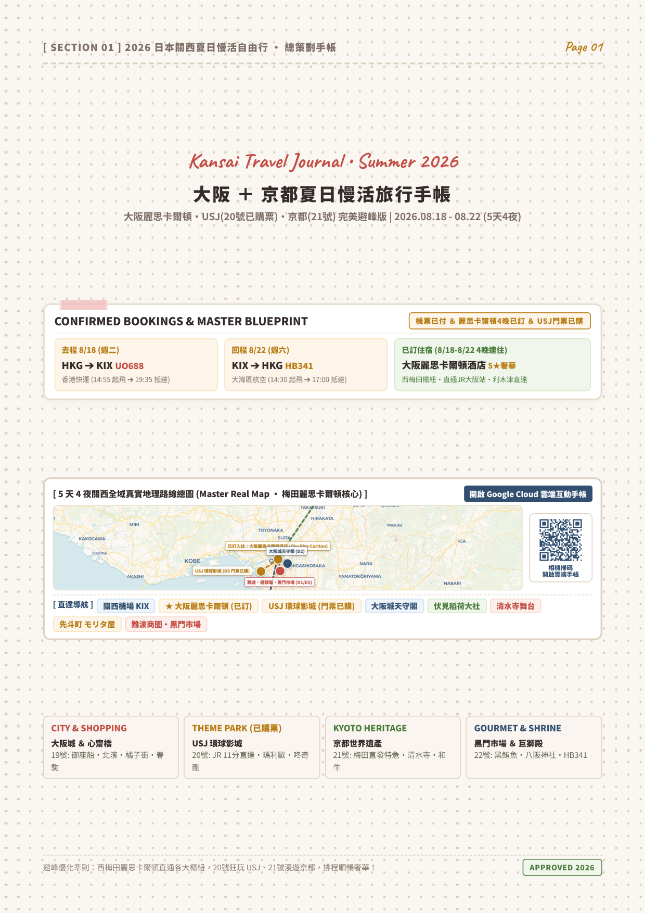
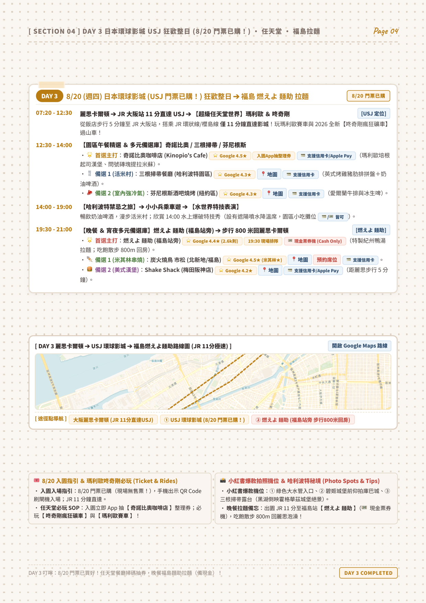
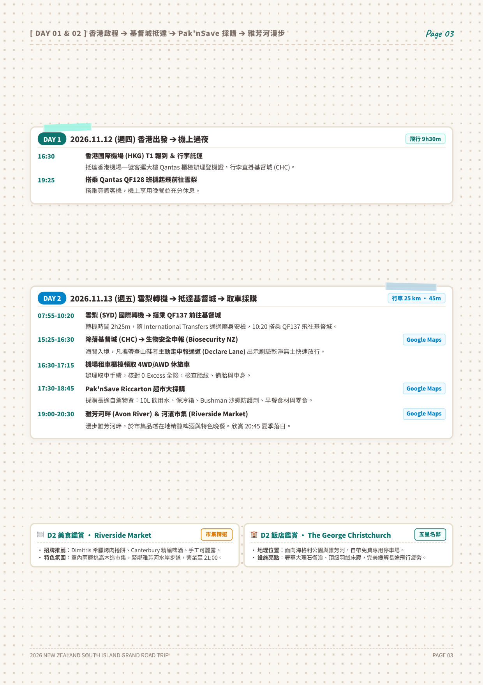
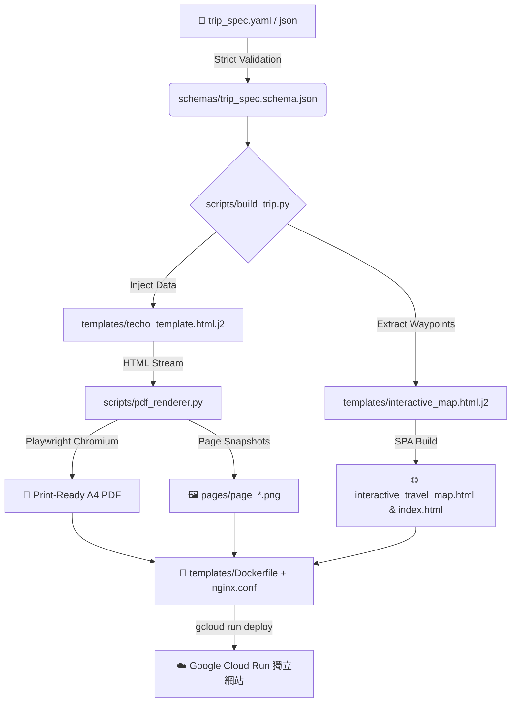

<div align="center">

# 🧭 Travel Planner & Zakka Techo System
### 🌸 出版級日系旅行手帳・Leaflet 三合一雲端互動地圖・Google Cloud Run 自動化發布套件

<p align="center">
  
  
  
  
  
  
</p>

<p align="center">
  <i>專為追求極致美感與嚴謹後勤的旅行者打造。<br>從飛行航段、自駕路權、米其林預訂到 A4 大字日系手帳與雲端互動地圖，一鍵生成、全端部署。</i>
</p>

---

[✨ 核心亮點](#-核心亮點) •
[📸 視覺預覽](#-視覺預覽) •
[🏗️ 系統架構](#️-系統架構) •
[🚀 快速上手](#-快速上手) •
[🗺️ 雙大經典行程範例](#️-雙大經典行程範例) •
[📚 專業知識庫](#-專業知識庫) •
[📄 授權條款](#-授權條款)

---

</div>

## 📸 視覺預覽 (Visual Gallery)

<div align="center">
  <table>
    <tr>
      <td width="33%" align="center">
        <b>📖 封面總覽 ＆ 航班時程</b><br><br>
        
      </td>
      <td width="33%" align="center">
        <b>🍽️ 米其林美食 ＆ 奢華飯店鑑賞</b><br><br>
        
      </td>
      <td width="33%" align="center">
        <b>🚗 紐西蘭南島 11天自駕大環線</b><br><br>
        
      </td>
    </tr>
  </table>
</div>

---

## ✨ 核心亮點 (Key Features)

### 1. 🌸 日系雜貨風手帳美學 (Zakka Techo Aesthetic)
* **經典手帳質感**：點陣底紙紋理 (`Dot-Grid Texture`)、和風半透明紙膠帶 (`Washi Tape`)、歐風手寫體 (`Caveat`) 搭配圓潤易讀黑體 (`Zen Maru Gothic`)。
* **高對比大字排版**：專為在途閱讀優化（10.5pt+ 易讀字級），徹底告別傳統攻略密密麻麻的小字疲勞。
* **米其林/名店鑑賞卡片**：捨棄紙本中雞肋的靜態地圖，全面替換為美食名物推薦、排隊點餐秘笈、五星住宿亮點與官方即時預訂管道。
* **行前 3 欄式 Check-list**：證件憑證、金融支付、氣候常備藥品與自駕後勤裝備全面盤點。

### 2. 🗺️ Triple-View 三合一雲端互動地圖 (Leaflet SPA)
* **模式 1【🗺️ 互動地圖】**：依天切換分日高對比路徑軌跡（Polyline）、景點座標、營業資訊與一鍵直達 `[📍 Google Maps 導航]`。
* **模式 2【📖 手帳在線預覽】**：高解析度手帳在線翻閱器，具備頂部懸浮藥丸快速跳頁。
* **模式 3【📑 雙欄左右對照】**：50% 互動地圖 ＋ 50% 手帳頁面，左邊看路線、右邊查細節，桌面端完美對照。

### 3. 🛡️ 確定性編譯與防破圖機制 (Deterministic Playwright Engine)
* **無頭瀏覽器雙向守衛**：Playwright 渲染時自動等待 `networkidle`、`document.fonts.ready` 與 `img.complete && img.naturalHeight > 0`，徹底杜絕字體遺失或地圖破圖。
* **高解析度向量輸出**：輸出 300+ DPI 印刷級 A4 PDF 及單頁高畫質 PNG 預覽圖。

### 4. ☁️ Google Cloud Run 容器化一鍵發布 (Zero-Config Deployment)
* 內建 Alpine Nginx 容器配置、Gzip 靜態壓縮與 SPA 路由重定向。
* 提供多專案並行部署腳本，秒級發布至 Google Cloud 全球低延遲節點（如 `asia-east2` 香港）。

---

## 🏗️ 系統架構 (Architecture)



---

## 🚀 快速上手 (Quick Start)

### 1. 安裝至 Antigravity 全域環境
```bash
# 複製倉庫並建立 Antigravity Skill 軟連結
git clone https://github.com/Leeababab/travel-planner-skill.git
cd travel-planner-skill
./install.sh --link
```

### 2. 一鍵編譯旅行套件
```bash
# 依據 YAML 規格生成 PDF 手帳與互動地圖
python3 scripts/build_trip.py \
  --spec tests/fixtures/sample_trip.yaml \
  --out-dir output/my_tokyo_trip
```

### 3. 執行全套自動化自檢
```bash
python3 scripts/test_skill.py
```

---

## 🗺️ 雙大經典行程範例 (Included Examples)

本倉庫內附兩套經過實地驗證的高階行程資料集，可直接作為新旅程的骨架：

| 行程代碼 | 目的地 | 天數 | 交通模式 | 特色亮點 | 檔案位置 |
| :--- | :--- | :--- | :--- | :--- | :--- |
| **`osaka_2026`** | 🇯🇵 日本關西 | 5天4夜 | 鐵道/地鐵/計程車 | 西梅田麗思卡爾頓 4 晚連住、USJ 瑪利歐+咚奇剛快通、鴨川納涼床和牛壽喜燒、松阪牛燒肉 M | [`examples/osaka_2026/`](examples/osaka_2026/) |
| **`new_zealand_2026`** | 🇳🇿 紐西蘭南島 | 11天10夜 | 4WD SUV 自駕 | 基督城大環線、米佛峽灣自然生態巡航、庫克山胡克谷吊橋健行、特卡波暗空保護區觀星 | [`examples/new_zealand_2026/`](examples/new_zealand_2026/) |

---

## 📚 專業知識庫 (Curated References)

Skill 內建豐富的國際旅行與自駕後勤百科：

* 🚗 **[道路交通守則與山道駕駛指引](references/road_safety_rules.md)**：紐西蘭單線橋（Single-Lane Bridge）路權判讀、陡坡引擎煞車（Engine Braking）、慢車禮讓灣；日本 ETC 系統與右轉路權。
* 🌿 **[各國生物安全與海關申報規範](references/biosecurity_customs.md)**：紐西蘭 MPI 嚴格申報規範（乾淨登山鞋快速通關攻略）；日本 Visit Japan Web 數位申報流程。
* 🍣 **[頂級餐廳搶位與預訂平台矩陣](references/dining_reservation_guide.md)**：日本 食べログ (Tabelog) 評分判讀、TableCheck 信用卡擔保機制、OMAKASE.in 放位時程表。
* ☁️ **[Google Cloud Run 生產部署指引](references/cloud_run_deployment.md)**：容器鏡像構建、Artifact Registry 與無伺服器網址綁定。

---

## 📂 目錄結構 (Directory Structure)

```text
travel-planner-skill/
├── SKILL.md                          # Antigravity Skill 核心規範與 5 大 Runbooks
├── schemas/
│   └── trip_spec.schema.json         # 嚴格 JSON Schema 規範定義
├── templates/
│   ├── techo_template.html.j2        # A4 日系手帳 Jinja2 模板
│   ├── interactive_map.html.j2       # Leaflet 三合一 SPA 模板
│   ├── portal_index.html.j2          # 多行程總門戶 Landing Page 模板
│   ├── Dockerfile                    # 輕量級 Nginx 容器配置
│   └── nginx.conf                    # 靜態快取與 Gzip 設定
├── scripts/
│   ├── build_trip.py                 # 一鍵編譯 CLI 工具
│   ├── pdf_renderer.py               # Playwright 確定性 PDF/PNG 渲染器
│   ├── tile_fetcher.py               # 地圖瓦片快取抓取器
│   ├── verify_links.py               # 外部 URL / 座標連通性檢測工具
│   └── test_skill.py                 # 自動化端到端測試套件
├── references/                       # 後勤、交通、海關、美食與雲端部署百科
├── examples/                         # 大阪 2026 與紐西蘭 2026 參考資料集
├── assets/                           # 高畫質預覽展示圖片
├── install.sh                        # Antigravity 一鍵安裝腳本
├── .gitignore                        # 零信任安全與憑證忽略規則
├── LICENSE                           # MIT 開源授權
└── README.md                         # 專案視覺文檔
```

---

<div align="center">

<b>Designed & Crafted with ❤️ by Alan Lee</b><br>
<i>Empowering seamless travel adventures with Agentic AI.</i>

</div>
