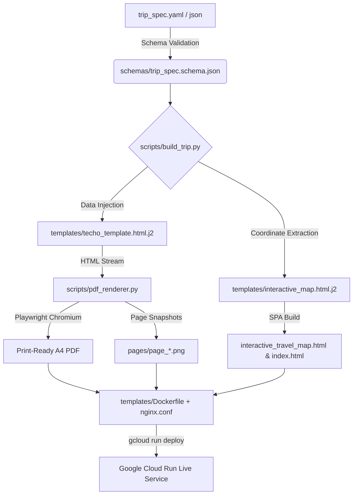
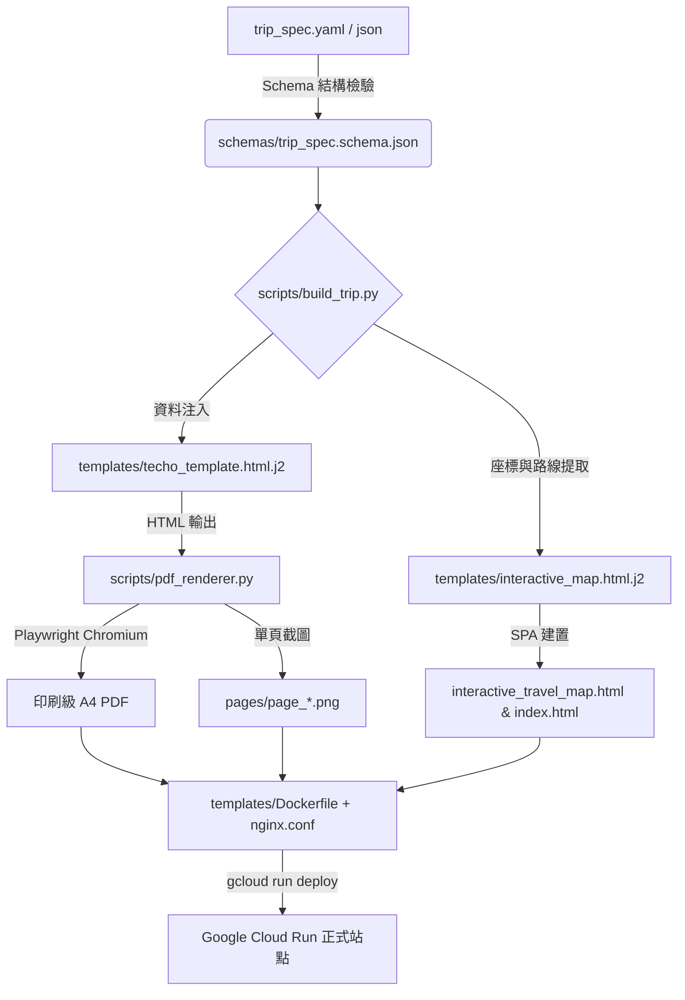

<div align="center">

# Travel Planner & Zakka Techo System
### Publication-Grade Travel Handbook, Leaflet Triple-View Interactive Web Application, and Automated Cloud Run Deployment Suite

<p align="center">
  
  
  
  
  
  
</p>

<p align="center">
  <b><a href="#english">English</a></b> | <b><a href="#繁體中文">繁體中文</a></b>
</p>

---

</div>

<a name="english"></a>

## English Documentation

### Overview
The **Travel Planner & Zakka Techo System** is an Antigravity Skill designed for comprehensive travel itinerary engineering, publication-grade Japanese Zakka-style A4 PDF travel journal compilation, and mobile-responsive Leaflet Triple-View single-page application (SPA) web generation.

### Key Capabilities
* **Structured Data Decoupling**: Separation of business travel data (`trip_spec.yaml` conforming to `trip_spec.schema.json`) from presentation layers.
* **Japanese Zakka Techo Typography**: Dot-grid background styling, washi-tape headers, stamp motifs, timeline rows, and large-format high-contrast typography optimized for on-the-road reading.
* **Dining and Hotel Spotlights**: Dedicated curation modules for Michelin restaurants, local delicacies, booking lead times, queue mitigation strategies, and luxury hotel reviews.
* **Leaflet Triple-View SPA**: Single-page web application offering three synchronized display modes:
  * *Interactive Map Mode*: Day-by-day polyline routes, GPS coordinates, spot summaries, and direct Google Maps deep-links.
  * *In-Browser Journal Reader Mode*: High-resolution multi-page journal viewer with sticky page navigation.
  * *Split Comparison Mode*: Side-by-side view (50% map + 50% journal reader) for desktop itinerary analysis.
* **Deterministic Headless Rendering**: Playwright-based rendering engine featuring synchronization guards (`networkidle`, `document.fonts.ready`, and `img.complete && img.naturalHeight > 0`) to eliminate font dropouts or tile glitches during PDF/PNG compilation.
* **Automated Cloud Run Deployment**: Built-in Alpine Nginx container configuration with Gzip compression and SPA rewrite rules for serverless hosting on Google Cloud Run.

### System Architecture


### Quick Start

#### 1. Install into Antigravity Global Environment
```bash
git clone https://github.com/Leeababab/travel-planner-skill.git
cd travel-planner-skill
./install.sh --link
```

#### 2. Build a Complete Trip Package
```bash
python3 scripts/build_trip.py \
  --spec tests/fixtures/sample_trip.yaml \
  --out-dir output/my_trip
```

#### 3. Run Automated Self-Test Suite
```bash
python3 scripts/test_skill.py
```

### Included Reference Datasets
* **Osaka, Japan (5 Days / 4 Nights)**: Public transit, Ritz-Carlton Osaka, Universal Studios Japan Express Pass, and Kamogawa Sukiyaki dining. Located in [`examples/osaka_2026/`](examples/osaka_2026/).
* **New Zealand South Island (11 Days / 10 Nights)**: 4WD SUV self-driving grand loop, Arthur's Pass, Milford Sound Nature Cruise, Mount Cook Hooker Valley, and Lake Tekapo Dark Sky Reserve. Located in [`examples/new_zealand_2026/`](examples/new_zealand_2026/).

### Reference Knowledge Bases
* **[Road Safety Regulations](references/road_safety_rules.md)**: New Zealand single-lane bridge priority rules, mountain pass engine braking, and Japan expressway ETC systems.
* **[Biosecurity and Customs Declarations](references/biosecurity_customs.md)**: New Zealand MPI declaration protocols (clean footwear procedures) and Japan Visit Japan Web registration.
* **[Dining Reservation Matrix](references/dining_reservation_guide.md)**: Tabelog rating analysis, TableCheck credit card guarantee mechanisms, and OMAKASE.in schedule guidelines.
* **[Cloud Run Deployment Guide](references/cloud_run_deployment.md)**: Container build commands, Artifact Registry management, and multi-service deployment configurations.

---

<a name="繁體中文"></a>

## 繁體中文文檔

### 專案概述
**Travel Planner & Zakka Techo System** 是一套專為 Antigravity 設計的專業旅行規劃技能（Skill）。本系統提供從行程資料結構化、日系大字手帳 A4 PDF 排版輸出，到 Leaflet 三合一雲端互動地圖單頁應用（SPA）與 Google Cloud Run 容器化自動部署的全流程解決方案。

### 核心功能
* **資料與呈現解耦**：採用嚴格 JSON Schema (`schemas/trip_spec.schema.json`) 規範，將行程資料（YAML/JSON）與前端 HTML/CSS 模板完全分離。
* **日系手帳排版美學**：內建點陣底紙紋理、和風紙膠帶標題、印章徽章與時間軸設計，採用 10.5pt 以上高對比大字排版，便於旅途中快速翻閱。
* **美食與住宿鑑賞專欄**：捨棄紙本手帳中不易查閱的靜態地圖，全面替換為米其林與特色名店推薦、點餐攻略、五星住宿評析與官方預訂管道。
* **Leaflet 三合一互動地圖 SPA**：
  * *互動地圖模式*：支援分日 Polyline 路線切換、景點座標標記、營業資訊與 Google Maps 導航直達。
  * *手帳在線閱讀器模式*：高解析度單頁手帳翻閱器，具備頂部懸浮導航條。
  * *雙欄對照模式*：50% 地圖 ＋ 50% 手帳頁面，支援桌面端左右同步對照。
* **確定性無頭渲染引擎**：基於 Playwright 構建，具備 `networkidle`、`document.fonts.ready` 與 `img.complete` 雙向同步守衛，確保 PDF 與預覽圖輸出零缺字、零破圖。
* **Google Cloud Run 容器化發布**：隨附 Alpine Nginx 容器配置、Gzip 壓縮與靜態路由重定向，支援多站點自動化部署至全球低延遲節點。

### 系統架構圖


### 快速開始

#### 1. 安裝至 Antigravity 全域環境
```bash
git clone https://github.com/Leeababab/travel-planner-skill.git
cd travel-planner-skill
./install.sh --link
```

#### 2. 一鍵建置行程套件
```bash
python3 scripts/build_trip.py \
  --spec tests/fixtures/sample_trip.yaml \
  --out-dir output/my_trip
```

#### 3. 執行自動化測試套件
```bash
python3 scripts/test_skill.py
```

### 內建參考資料集
* **日本關西大阪（5天4夜）**：大眾運輸、西梅田麗思卡爾頓、環球影城快通與鴨川納涼床和牛壽喜燒。存放於 [`examples/osaka_2026/`](examples/osaka_2026/)。
* **紐西蘭南島（11天10夜）**：4WD SUV 自駕大環線、亞瑟隘口、米佛峽灣自然生態巡航、庫克山胡克谷健行與特卡波觀星。存放於 [`examples/new_zealand_2026/`](examples/new_zealand_2026/)。

### 專業知識庫
* **[道路交通守則與山道駕駛指引](references/road_safety_rules.md)**：紐西蘭單線橋路權判讀、長下坡引擎煞車技巧；日本高速公路 ETC 系統與路權規範。
* **[生物安全與海關申報規範](references/biosecurity_customs.md)**：紐西蘭 MPI 戶外裝備申報流程；日本 Visit Japan Web 數位申報指引。
* **[餐廳預訂與評分指南](references/dining_reservation_guide.md)**：日本 Tabelog 評分標準、TableCheck 擔保機制與 OMAKASE.in 放位時程。
* **[Google Cloud Run 部署指引](references/cloud_run_deployment.md)**：容器鏡像建置、Artifact Registry 管理與多專案部署命令。

---

<a name="license"></a>

## License / 授權條款

This project is licensed under the MIT License. See the [LICENSE](LICENSE) file for details.
