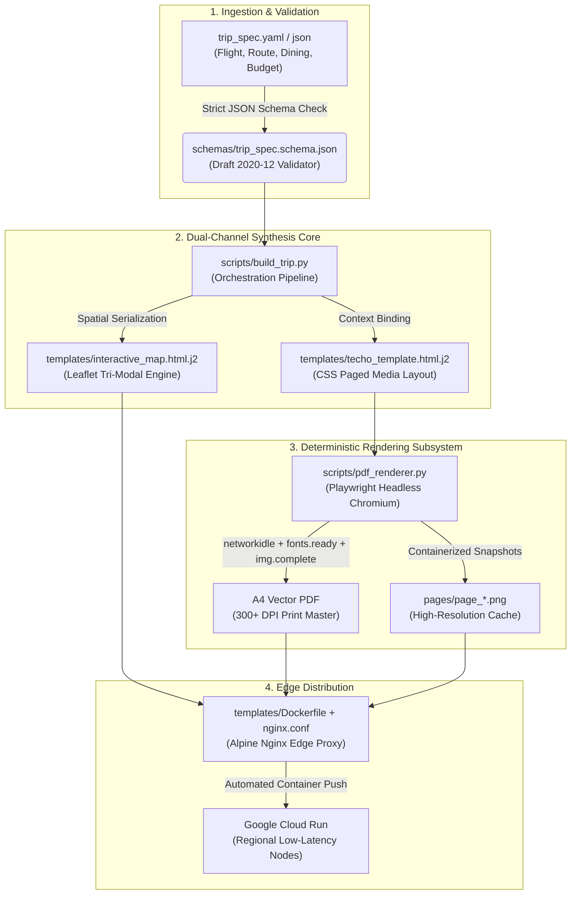
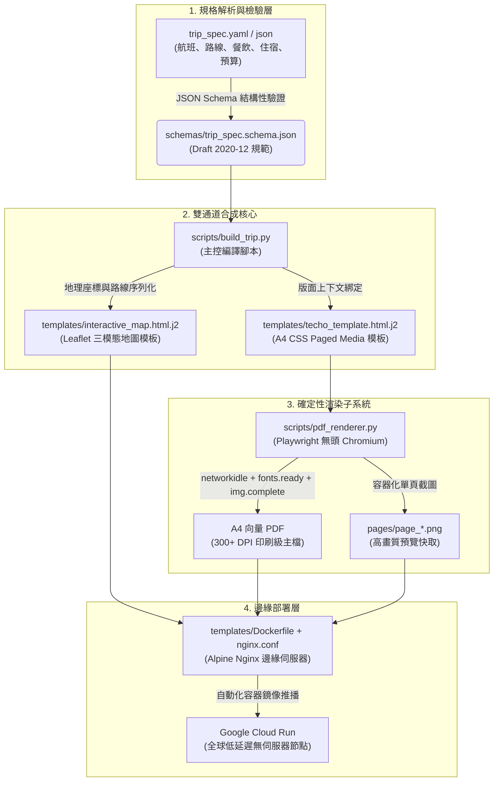

<div align="center">

# TRAVEL PLANNER & ZAKKA TECHO SYSTEM
**Autonomous Travel Engineering, Deterministic Typography & Spatial Cartography Engine**

```
========================================================================================
[ SPECIFICATION ]        [ DUAL SYNTHESIS ]       [ DETERMINISTIC ENGINE ]     [ CLOUD EDGE ]
trip_spec.yaml    -->    Jinja2 + Leaflet   -->   Playwright Headless      --> Cloud Run / Nginx
========================================================================================
```

<p align="center">
  
  
  
  
  
  
</p>

<p align="center">
  <a href="#english-documentation"><b>ENGLISH</b></a> &nbsp;|&nbsp; <a href="#繁體中文文檔"><b>繁體中文</b></a>
</p>

---

</div>

<a name="english-documentation"></a>

## English Documentation

### 1. Executive Summary

The **Travel Planner & Zakka Techo System** is an enterprise-grade agentic skill designed for Antigravity. It formalizes end-to-end expedition planning into a strictly typed, schema-validated engineering workflow.

The engine transforms structured travel declarations (`trip_spec.yaml`) into two synchronized production deliverables:
1. **Publication-Grade A4 Travel Journal (PDF)**: Formatted in Japanese Zakka Techo typography with strict CSS Paged Media pagination, dot-grid texturing, and curated culinary/hospitality modules.
2. **Tri-Modal Spatial Web Application (SPA)**: A high-performance Leaflet single-page application featuring synchronized interactive mapping, in-browser journal reading, and side-by-side split desktop analysis.

---

### 2. Architectural Blueprint



---

### 3. Engineering Specifications & Capabilities

| Capability Domain | Technical Implementation | Architectural Guarantee |
| :--- | :--- | :--- |
| **Data Schema Formalism** | JSON Schema (Draft 2020-12) | Zero-loss separation between declarative trip data and visual layout layers. |
| **Typography Engine** | A4 CSS Paged Media (`@page { size: A4 portrait; margin: 0; }`) | Strict 297mm containerization; zero orphaned page-breaks or misaligned double spreads. |
| **Deterministic Rendering** | Headless Playwright Chromium Synchronization Guards | Tri-phase validation: `networkidle`, `document.fonts.ready`, and image DOM verification before PDF print. |
| **Tri-Modal Cartography** | Leaflet 1.9+ Vector Engine with CartoDB Voyager | Interactive Map, Virtual Journal Reader, and 50/50 Desktop Split View with synchronized coordinate bounding. |
| **Resilient Tile Subsystem** | `scripts/tile_fetcher.py` | Local disk caching (`.tile_cache/`), custom User-Agent injection, and exponential backoff retry. |
| **Link Integrity Verification** | `scripts/verify_links.py` | Automated asynchronous HTTP status code audits across all external booking and navigation endpoints. |
| **Production Distribution** | Nginx Alpine Containerization | Gzip static compression, immutable asset caching, and single-page routing rewrite policies. |

---

### 4. Component Matrix

```
travel-planner-skill/
├── SKILL.md                          # Antigravity operational manifest & runbook protocols
├── schemas/
│   └── trip_spec.schema.json         # Strict JSON Schema defining the data contract
├── templates/
│   ├── techo_template.html.j2        # Jinja2 template for Japanese Zakka Techo A4 journal
│   ├── interactive_map.html.j2       # Jinja2 template for Leaflet Tri-Modal SPA
│   ├── portal_index.html.j2          # Landing portal template for multi-trip hosting
│   ├── Dockerfile                    # Container definition based on alpine-nginx
│   └── nginx.conf                    # Production HTTP proxy configuration
├── scripts/
│   ├── build_trip.py                 # Monolithic CLI generator
│   ├── pdf_renderer.py               # Deterministic Playwright PDF/PNG compilation engine
│   ├── tile_fetcher.py               # Map tile fetcher with local cache & backoff
│   ├── verify_links.py               # Automated URL and coordinate validator
│   └── test_skill.py                 # End-to-end automated validation suite
├── references/
│   ├── road_safety_rules.md          # Driving protocols (New Zealand & Japan)
│   ├── biosecurity_customs.md        # Customs and biosecurity declaration guides
│   ├── dining_reservation_guide.md   # Reservation mechanics (Tabelog, TableCheck, OMAKASE)
│   └── cloud_run_deployment.md       # Google Cloud Run deployment runbook
├── examples/
│   ├── osaka_2026/trip_spec.yaml     # 5-Day Kansai reference implementation
│   └── new_zealand_2026/trip_spec.yaml # 11-Day South Island reference implementation
├── tests/fixtures/
│   └── sample_trip.yaml              # Deterministic test fixture
├── install.sh                        # Symlink installer for Antigravity environment
├── .gitignore                        # Strict credential and artifact exclusion rules
├── .env.example                      # Environment template for third-party API keys
├── LICENSE                           # MIT License
└── README.md                         # Technical documentation
```

---

### 5. Quick Start & Execution Toolchain

#### Step 1: Install into Antigravity
```bash
# Clone the repository and create an active skill symlink
git clone https://github.com/Leeababab/travel-planner-skill.git
cd travel-planner-skill
./install.sh --link
```

#### Step 2: Build a Trip Package from Specification
```bash
# Execute compilation pipeline
python3 scripts/build_trip.py \
  --spec tests/fixtures/sample_trip.yaml \
  --out-dir output/sample_trip
```

#### Step 3: Run Automated Test Suite
```bash
# Validate schema, templates, rendering guards, and outputs
python3 scripts/test_skill.py
```

---

### 6. Reference Knowledge Bases

* **[Road Safety & Mountain Pass Protocol](references/road_safety_rules.md)**: New Zealand single-lane bridge priorities, mountain pass engine braking (M1/M2), and Japan expressway ETC operations.
* **[Biosecurity & Quarantine Guidelines](references/biosecurity_customs.md)**: New Zealand MPI clean footwear fast-track procedures and Japan Visit Japan Web digital customs workflows.
* **[Dining Reservation Architecture](references/dining_reservation_guide.md)**: Tabelog ranking analysis, TableCheck deposit protocols, and OMAKASE.in monthly allocation cycles.
* **[Cloud Run Deployment Runbook](references/cloud_run_deployment.md)**: Multi-service container compilation, Google Artifact Registry management, and regional HTTPS termination.

---

<hr style="border: 0; height: 1px; background: #e2e8f0; margin: 40px 0;" />

<a name="繁體中文文檔"></a>

## 繁體中文文檔

### 1. 系統綜述

**Travel Planner & Zakka Techo System** 是專為 Antigravity 設計的工程級旅行規劃與出版系統。本套件將複雜的跨國行程設計、交通路權後勤、米其林預訂時程與預算編制，抽象為嚴格型別定義的標準化工作流程。

系統能將結構化行程宣告檔（`trip_spec.yaml`）一鍵編譯為兩套高度同步的交付成果：
1. **出版級 A4 日系手帳（PDF）**：採用日系雜貨手帳排版美學、嚴格 CSS Paged Media 分頁控制、點陣底紙質感，並整合米其林/名店鑑賞與奢華住宿專欄。
2. **三模態空間互動網頁（SPA）**：基於 Leaflet 構建的單頁應用程式，具備即時互動地圖、在線手帳翻閱器與 50/50 雙欄對照分析視圖。

---

### 2. 系統架構圖



---

### 3. 技術規格與核心指標

| 領域 | 技術實現 | 架構保證 |
| :--- | :--- | :--- |
| **資料規格規範** | JSON Schema (Draft 2020-12) | 宣告式行程資料與視覺呈現層完全解耦，確保跨目的地可複用性。 |
| **手帳排版引擎** | A4 CSS Paged Media (`@page { size: A4; }`) | 嚴格 297mm 頁面高度約束；杜絕文字孤行、溢出與跨頁失位。 |
| **確定性無頭渲染** | Playwright Chromium 雙向同步守衛 | 三重加載驗證（網路閒置、字體就緒、圖片加載完畢），杜絕字體回退或瓦片缺損。 |
| **三模態空間地圖** | Leaflet 1.9+ 結合 CartoDB Voyager | 互動地圖、虛擬手帳閱讀器、桌面端 50/50 雙欄對照模式，支援視角自適應邊界。 |
| **地圖瓦片快取系統** | `scripts/tile_fetcher.py` | 本機檔案快取（`.tile_cache/`）、自訂 User-Agent 識別與指數退避重試機制。 |
| **外部連結完整性審查** | `scripts/verify_links.py` | 非同步 HTTP 狀態碼自動化排查，杜絕 404 失效與無效地理座標。 |
| **生產環境容器化** | Alpine Nginx 輕量化映像 | 內建 Gzip 靜態壓縮、不可變靜態資源快取與 SPA 路由重定向。 |

---

### 4. 模組化目錄結構

```
travel-planner-skill/
├── SKILL.md                          # Antigravity 核心規範與 5 大標準 Runbook
├── schemas/
│   └── trip_spec.schema.json         # 嚴格資料契約定義（JSON Schema）
├── templates/
│   ├── techo_template.html.j2        # A4 日系手帳 Jinja2 模板
│   ├── interactive_map.html.j2       # Leaflet 三模態互動地圖 Jinja2 模板
│   ├── portal_index.html.j2          # 多行程總門戶 Landing Page 模板
│   ├── Dockerfile                    # Alpine Nginx 容器定義
│   └── nginx.conf                    # 生產級 HTTP 代理與壓縮配置
├── scripts/
│   ├── build_trip.py                 # 一鍵編譯 CLI 工具
│   ├── pdf_renderer.py               # Playwright 確定性 PDF/PNG 渲染器
│   ├── tile_fetcher.py               # 地圖瓦片快取抓取器
│   ├── verify_links.py               # 外部 URL / 座標連通性檢測工具
│   └── test_skill.py                 # 自動化端到端測試套件
├── references/
│   ├── road_safety_rules.md          # 紐西蘭與日本自駕交通手冊
│   ├── biosecurity_customs.md        # 生物安全與入境海關申報規範
│   ├── dining_reservation_guide.md   # Tabelog、TableCheck、OMAKASE 搶位指南
│   └── cloud_run_deployment.md       # Google Cloud Run 生產部署指引
├── examples/
│   ├── osaka_2026/trip_spec.yaml     # 日本關西 5 天 4 夜參考資料集
│   └── new_zealand_2026/trip_spec.yaml # 紐西蘭南島 11 天 10 夜參考資料集
├── tests/fixtures/
│   └── sample_trip.yaml              # 測試專用標準資料集
├── install.sh                        # Antigravity 全域軟連結安裝腳本
├── .gitignore                        # 零信任安全與憑證忽略規則
├── .env.example                      # API 密鑰環境變數模板
├── LICENSE                           # MIT 開源授權
└── README.md                         # 雙語工程技術文檔
```

---

### 5. 快速上手與執行指令

#### 步驟 1：安裝至 Antigravity 全域環境
```bash
# 複製倉庫並建立 Antigravity Skill 軟連結
git clone https://github.com/Leeababab/travel-planner-skill.git
cd travel-planner-skill
./install.sh --link
```

#### 步驟 2：依據規格檔編譯行程套件
```bash
# 執行編譯管線（生成 HTML、PDF 與高解析度單頁預覽）
python3 scripts/build_trip.py \
  --spec tests/fixtures/sample_trip.yaml \
  --out-dir output/sample_trip
```

#### 步驟 3：執行自動化整合測試
```bash
# 驗證 Schema、模板合成、渲染防護機制與輸出檔案完整性
python3 scripts/test_skill.py
```

---

### 6. 後勤與專業知識庫

* **[道路交通守則與山道駕駛指引](references/road_safety_rules.md)**：紐西蘭單線橋（Single-Lane Bridge）路權判讀、長下坡引擎煞車（M1/M2）操作；日本高速公路 ETC 系統與路權規範。
* **[生物安全與海關申報規範](references/biosecurity_customs.md)**：紐西蘭 MPI 戶外裝備申報流程（乾淨鞋底快速通關）；日本 Visit Japan Web 數位申報指引。
* **[餐廳預訂與評分指南](references/dining_reservation_guide.md)**：日本 Tabelog 評分標準、TableCheck 擔保機制與 OMAKASE.in 放位時程表。
* **[Google Cloud Run 部署指引](references/cloud_run_deployment.md)**：多專案容器構建、Artifact Registry 管理與全球低延遲部署命令。

---

<a name="license"></a>

## License / 授權條款

This project is licensed under the MIT License. See the [LICENSE](LICENSE) file for details.
